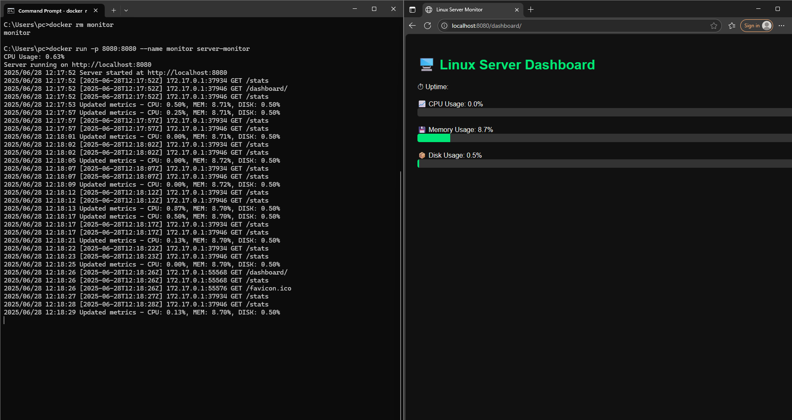

# 🖥️ Linux Server Monitor (Go)

A lightweight REST API application built in Golang to monitor Linux server health in real-time — with Docker support, Prometheus metrics, graceful shutdown, and a web dashboard.

---

## 🚀 Features

- 📈 **CPU Usage** – Real-time percentage
- 💾 **Memory Usage** – Used memory percentage
- 🧮 **Disk Usage** – Root partition usage
- ⏱️ **Uptime** – How long the system has been running
- 🌐 **REST API** – `/stats`, `/uptime`, `/health`, `/metrics`
- 📊 **Prometheus Exporter** – Easily scraped by Prometheus
- 🔁 **Auto-updating** – Background metrics refresh every 3s
- 📋 **Request Logging** – Logs all HTTP activity
- 🌐 **Web Dashboard** – Live stats at `/dashboard/`
- 🐳 **Dockerized** – Easily containerized and deployed

---

## 📁 Project Structure

```

server-monitor/
├── main.go                 # Entry point
├── monitor/                # Metrics collection logic
│   ├── cpu.go
│   ├── memory.go
│   ├── disk.go
│   └── uptime.go
├── api/                    # API logic
│   ├── router.go           # Starts HTTP server
│   ├── handlers.go         # /stats, /uptime, /health
│   ├── metrics.go          # Prometheus + metric updater
│   └── middleware.go       # Logging
├── static/                 # Web dashboard assets
│   └── index.html
├── Dockerfile              # Multi-stage Docker build
└── go.mod / go.sum         # Module dependencies

````

---

## 📦 Requirements

- Go 1.21+ (You used Go 1.24.4)
- Linux, WSL2, or macOS
- Docker (optional, for containerization)

---

## 🔧 Run Locally (Without Docker)

```bash
# Clone the project
git clone https://github.com/vivekmaru36/server-monitor.git
cd server-monitor

# Install dependencies
go mod tidy

# Run the app
go run main.go

# Access in browser or via curl
curl http://localhost:8080/stats
````

---

## 🐳 Run with Docker

### 📄 Build the Docker image

```bash
docker build -t server-monitor .
```

### ▶️ Start the container

```bash
docker run -p 8080:8080 --name monitor server-monitor
```

### 🧹 Restart if container stops

```bash
docker rm monitor
docker run -p 8080:8080 --name monitor server-monitor
```

---

## ✅ Test the API

```bash
curl http://localhost:8080/stats
curl http://localhost:8080/uptime
curl http://localhost:8080/health
curl http://localhost:8080/metrics
```

---

## 🌐 API Endpoints

| Method | Endpoint      | Description                         |
| ------ | ------------- | ----------------------------------- |
| GET    | `/stats`      | JSON output of all resource usage   |
| GET    | `/uptime`     | System uptime in plain text         |
| GET    | `/health`     | Health check response (`200 OK`)    |
| GET    | `/metrics`    | Prometheus scrape-compatible output |
| GET    | `/dashboard/` | HTML dashboard UI                   |

---

## 📸 Sample Output

### GET `/stats`

```json
{
  "uptime": "up 40 minutes",
  "cpu_usage": 1.34,
  "memory_usage": 5.12,
  "disk_usage": 22.4
}
```

### GET `/uptime`

```
up 40 minutes
```

---

## 📊 Web + Terminal View

### Dashboard View



---

## 🛠️ Work in Progress

| Status | Feature                                    |
| ------ | ------------------------------------------ |
| ✅      | `/health`, `/metrics`, `/dashboard` routes |
| ✅      | Prometheus metrics integration             |
| ✅      | Controlled shutdown via `SIGINT`, `SIGTERM`  |
| ✅      | Dockerized container + multi-stage build   |
| ✅      | HTML Dashboard with live auto-refresh      |
| ✅      | Request logging with IP/time/endpoint      |
| ⏳      | Add CPU core count and load average        |
| ⏳      | Show RAM in MB/GB alongside percentage     |
| ⏳      | Include disk usage for multiple mounts     |
| ⏳      | Add server hostname and Linux distro info  |
| ⏳      | Add CPU temperature (if available)         |
| ⏳      | Add dark/light toggle in dashboard UI      |
| ⏳      | Add system alerts (e.g., high CPU warning) |